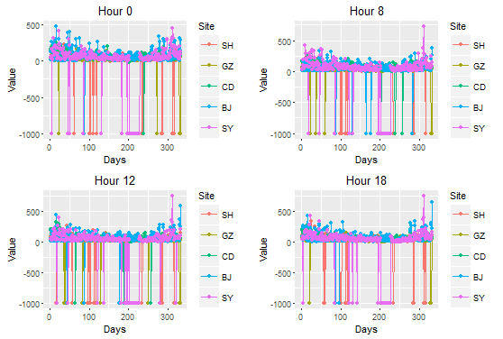
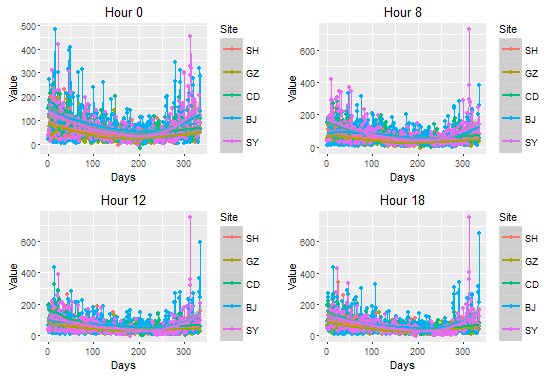
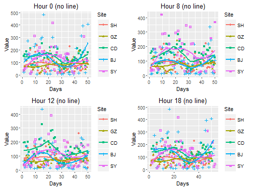
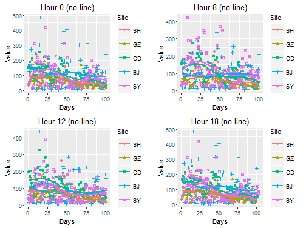

```{r}
suppressPackageStartupMessages({
   library(png)
   library(ggplot2)
   library(gridExtra)
   })

setwd("C:/Users/myuser/Desktop/628/PartA")
```


- Picture 1: Raw data



- Picture 2: Without Missing Values



- Picture 3: First 50 days



- Picture 4: First 100 days



- Loading picture directly may not be a good way for composing. You can get this picture through the folloing code


```{r}
load("air_all.Rda")

air_0 <-air_all[air_all$Hour==0,]
air_8 <-air_all[air_all$Hour==8,]
air_12 <-air_all[air_all$Hour==12,]
air_18 <-air_all[air_all$Hour==18,]
```

####txx_p1.png####
```{r}
p_air0<-ggplot(data = air_0, aes(x=Days,y = Value,color = Site)) + geom_line() + 
      geom_point() + ggtitle("Hour 0")

p_air8<-ggplot(data = air_8, aes(x=Days,y = Value,color = Site)) + geom_line() + 
      geom_point() + ggtitle("Hour 8")      

p_air12<-ggplot(data = air_12, aes(x=Days,y = Value,color = Site)) + geom_line() + 
      geom_point() + ggtitle("Hour 12")     


p_air18<-ggplot(data = air_18, aes(x=Days,y = Value,color = Site)) + geom_line() + 
      geom_point() + ggtitle("Hour 18")  

grid.arrange(p_air0,p_air8,p_air12, p_air18, ncol=2,nrow=2)
```

####txx_p2.png####
```{r}
air_all <-air_all[air_all$Value!=-999,]
air_0 <-air_all[air_all$Hour==0,]
air_8 <-air_all[air_all$Hour==8,]
air_12 <-air_all[air_all$Hour==12,]
air_18 <-air_all[air_all$Hour==18,]


p_air0<-ggplot(data = air_0, aes(x=Days,y = Value,color = Site)) + geom_line() + 
      geom_point() + ggtitle("Hour 0")

p_air8<-ggplot(data = air_8, aes(x=Days,y = Value,color = Site)) + geom_line() + 
      geom_point() + ggtitle("Hour 8")      

p_air12<-ggplot(data = air_12, aes(x=Days,y = Value,color = Site)) + geom_line() + 
      geom_point() + ggtitle("Hour 12")     


p_air18<-ggplot(data = air_18, aes(x=Days,y = Value,color = Site)) + geom_line() + 
      geom_point() + ggtitle("Hour 18")  

grid.arrange(p_air0,p_air8,p_air12, p_air18, ncol=2,nrow=2)
```


####txx_p3.png####
```{r}
p1<-ggplot(data = air_0[air_0$Days <51,], 
                aes(x=Days,y = Value,color = Site))+ 
                geom_point(aes(shape = Site ) )+
                geom_smooth(se = FALSE)+ ggtitle("Hour 0 (no line)")

p2<-ggplot(data = air_8[air_8$Days <51,], 
                aes(x=Days,y = Value,color = Site))+ 
                geom_point(aes(shape = Site ) )+
                geom_smooth(se = FALSE)+ ggtitle("Hour 8 (no line)")

p3<-ggplot(data = air_12[air_12$Days <51,], 
                aes(x=Days,y = Value,color = Site))+ 
                geom_point(aes(shape = Site ) )+
                geom_smooth(se = FALSE)+ ggtitle("Hour 12 (no line)")

p4<-ggplot(data = air_0[air_18$Days <51,], 
                aes(x=Days,y = Value,color = Site))+ 
                geom_point(aes(shape = Site ) )+
                geom_smooth(se = FALSE)+ ggtitle("Hour 18 (no line)")

grid.arrange(p1,p2,p3,p4, ncol=2,nrow=2)

```

####txx_p4.png####
```{r}
p1<-ggplot(data = air_0[air_0$Days <101,], 
                aes(x=Days,y = Value,color = Site))+ 
                geom_point(aes(shape = Site ) )+
                geom_smooth(se = FALSE)+ ggtitle("Hour 0 (no line)")

p2<-ggplot(data = air_8[air_8$Days <101,], 
                aes(x=Days,y = Value,color = Site))+ 
                geom_point(aes(shape = Site ) )+
                geom_smooth(se = FALSE)+ ggtitle("Hour 8 (no line)")

p3<-ggplot(data = air_12[air_12$Days <101,], 
                aes(x=Days,y = Value,color = Site))+ 
                geom_point(aes(shape = Site ) )+
                geom_smooth(se = FALSE)+ ggtitle("Hour 12 (no line)")

p4<-ggplot(data = air_0[air_18$Days <101,], 
                aes(x=Days,y = Value,color = Site))+ 
                geom_point(aes(shape = Site ) )+
                geom_smooth(se = FALSE)+ ggtitle("Hour 18 (no line)")

grid.arrange(p1,p2,p3,p4, ncol=2,nrow=2)
```

####txx_p5.png####

```{r}
p1<-ggplot(data = air_0[air_0$Days <101 &air_0$Days >50,], 
                aes(x=Days,y = Value,color = Site))+ 
                geom_point(aes(shape = Site ) )+
                geom_smooth(se = FALSE)+ ggtitle("Hour 0 (no line)")

p2<-ggplot(data = air_8[air_8$Days <101 &air_8$Days >50,], 
                aes(x=Days,y = Value,color = Site))+ 
                geom_point(aes(shape = Site ) )+
                geom_smooth(se = FALSE)+ ggtitle("Hour 8 (no line)")

p3<-ggplot(data = air_12[air_12$Days <101 &air_12$Days >50,], 
                aes(x=Days,y = Value,color = Site))+ 
                geom_point(aes(shape = Site ) )+
                geom_smooth(se = FALSE)+ ggtitle("Hour 12 (no line)")

p4<-ggplot(data = air_0[air_18$Days <101 &air_18$Days >50,], 
                aes(x=Days,y = Value,color = Site))+ 
                geom_point(aes(shape = Site ) )+
                geom_smooth(se = FALSE)+ ggtitle("Hour 18 (no line)")

grid.arrange(p1,p2,p3,p4, ncol=2,nrow=2)
```