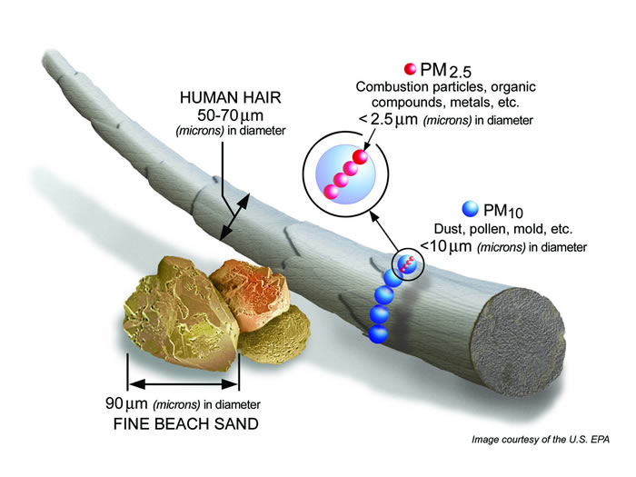
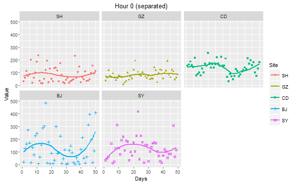
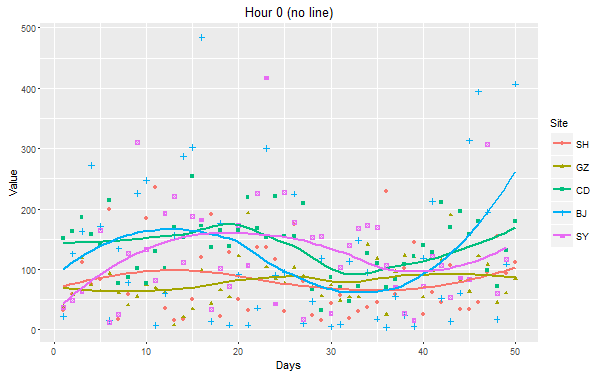
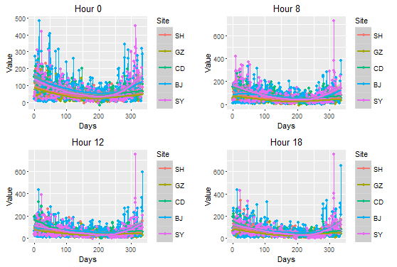
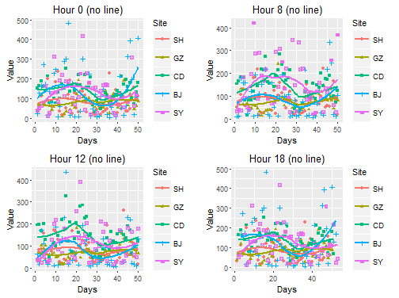

Air Pollution in Five Major Chinese Cities
========================================================
author: Ruoying Jiang, Shenqian Chen, Xingxing Tong, Alex Dewey
date: February 11, 2016

Why study it?
========================================================
A widely-circulated 2015 study from American
think tank Berkeley Earth estimated from available literature
as many as 1.2 to 2 million premature deaths a year from air pollution
in China alone. Particulate matter causes "premature death 
in people with heart and lung disease" per the EPA. 
These numbers are backed up by the World
Health Organization, the Lancet, and the IHME.

Former Health minister Chen Zhu published 
in the Lancet a conservative estimate of between
350,000 and 500,000 deaths a year. For comparison,
Dane, Iowa, Green, and Columbia counties (the 
Madison Metro statistical area) had a total
2010 population of 568,593.

Why study these cities?
========================================================
Reliable, accessible data taken hourly.

Combined population of 5 cities' administrative areas is greater than
100 million people (some 1.5% of the human population 
and 7% of the population of China)

Air pollution is caused by human activity
such as industry, heating, and transportation
and cities are one obvious starting point
for China's efforts to improve air quality.

About the Data
========================================================
The United States Department of State measures
air quality data at five locations--the U.S. Embassy in
Beijing, and the Consulates in Chengdu, Guangzhou,
Shanghai, and Shenyang. 

The data is measured in terms of PM2.5, which measures the 
total mass of fine particles in the atmosphere (micrograms
per cubic meter).

EPA Figure
========================================================

Meterological Data
========================================================
While PM2.5 is caused by human activity, we think
an intriguing area of study is the short-term effect of
meterological data for the five cities on the readings.

This data (from the site "Weather Underground") 
contains temperature, dew-point, humidity, sea-level
pressure, visibility, and wind speed.

Using Meterological Data (Shenquian/Ruoying)
========================================================
- Step 1 Combine meteorological data with the Mean.PM2.5 data.
- Step 2 Fit regression model without days indicate significant high values of PM2.5(>250).
- Step 3 Do specific reaserch&analysis for days that PM2.5>250 (outliers).

Why choose these four specific hours?
========================================================
In August 2015, the Chinese government stopped much of its
industrial capacity and traffic for a 
WWII 70th anniversary celebration called "Parade Blue".

PM2.5 readings quickly dropped below 19.5 and averaged 35 micrograms/m^3

http://energydesk.greenpeace.org/2015/08/27/china-air-pollution-beijing-records-its-cleanest-air-ever/

Why choose these four specific hours?
========================================================
Parade Blue demonstrated how sensitive particulate readings
are to short-term human activities (and reduction).

We're using hours 0, 8, 12, 18 in order to account
for the effect of the most important times of day
without overcomplicating things.

Part I (Xingxing) Example Plot 1
========================================================

Part I (Xingxing) Example Plot 2
========================================================

Part I (Xingxing) Raw data plot
========================================================
How do we deal with missing values? 

Part I (Xingxing)
========================================================

(delete 1483 missing values [after sending them to -999])

Part I (Xingxing)
========================================================

Part II (Shenquian/Ruoying)
========================================================
- Step 1 Combine meteorological data with the Mean.PM2.5 data.

Part II (Shenquian/Ruoying)
========================================================
- Step 2 Fit regression model without days indicate significant high values of PM2.5(>250).

Part II (Shenquian/Ruoying)
========================================================
- Step 3 Do specific reaserch&analysis for days that PM2.5>250 (outliers).

Part III (Alex)
========================================================
Some blind alleys

Hierarchical Model--Big dataset
========================================================
NOAA Reanalysis dataset--perfect, but way too complicated
to interpret, parse, and group. Simpler datasets
are available.

Lots of missing data--meant for building climate models,
not small-scale, localized projects.

"Self-documenting code", but requires some expert domain
knowledge

Hierarchical Model--It's the thought that counts
========================================================
Idea is to treat city as a fixed effect
and compute readings by month/day as random effects
with multiple error terms

Makes more sense for grouping dozens of 
messy, missing, spatially-dispersed meteorogical
data with multiple readings--not so useful for
estimating parameters with single samples.

Might be useful for handling "repeated samples" from 
groupings in mornings, afternoon, evening, night. 

More useful for ggplot/organization than for stats
in this project (1 object instead of 5)

Future Directions (Anyone)
========================================================
